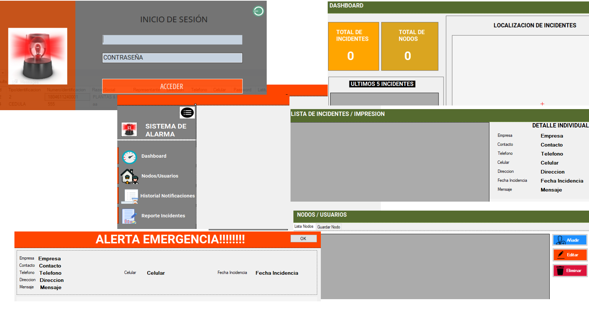
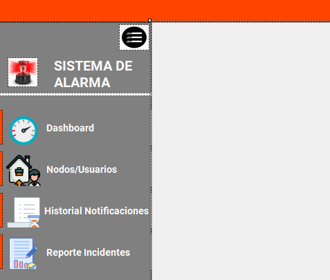
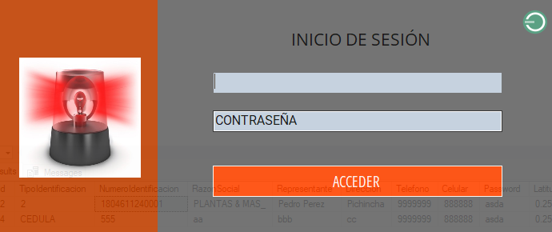
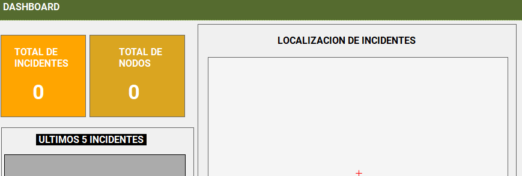
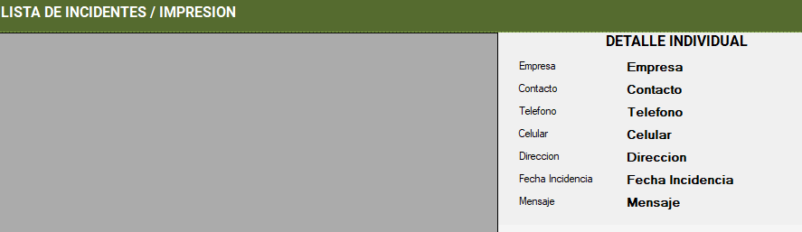
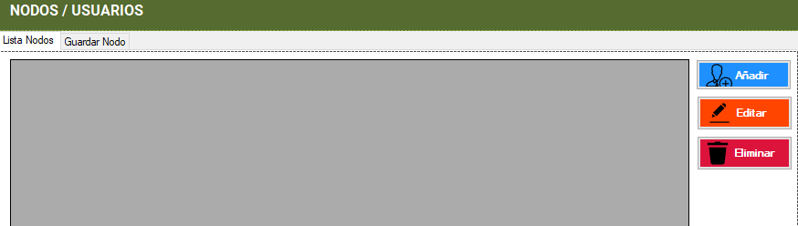
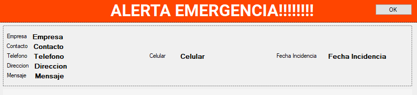

# Sistema de Notificación de Alerta de Emergencia o Pánico
Frente al incremento de la inseguridad en el Ecuador, es imperante contar con herramientas que permitan comunicar con el menor esfuerzo sobre si una persona esta sufriendo algún tipo de ataque, es asi que se popularizan los botones de pánico

## Tecnologías utilizadas

- .Net
- VS
- SQL Server
- Firebase
- C#

## Características

### Aplicación cliente Móvil:
 - La app movil permite al ciudadano disponer de una herramienta que previo a su registro y validación por parte de la institución a cargo, puede con solo presionar un boton de su teléfono comunicar a los usuarios cercanos y a la autoridad a cargo principalmente cuando se encuentre bajo ataque, enviando su hubicación mediante notificaciones en tiempor real a los usuarios parametrizados

### Aplicación cliente Escritorio:
-  La app de escritorio permite al personal de la institución a cargo gestionar, tanto los usuarios como las alertas que se generan para proceder con la cordinación efectiva de las autoridades pertinentes.

### Galería:
- 

## Instalación y ejecución
-Para poder correr esta aplicaion es necesario tener instala flutter, dart, Angular.
- Pasos:
1. Clona o descarga este repositorio en tu máquina local.
  Aplicación Escritorio
-. Abre el proyecto en VS .
-. Crea las bases de datos
-. Configura la conexión.

## Contribución

Si deseas contribuir a este proyecto, sigue estos pasos:

1. Haz un fork de este repositorio.
2. Crea una rama con un nombre descriptivo: `git checkout -b nombre-de-la-rama`.
3. Realiza tus cambios y guarda los archivos modificados.
4. Haz commit de tus cambios: `git commit -m 'Descripción de los cambios'`.
5. Envía tus cambios al repositorio remoto: `git push origin nombre-de-la-rama`.
6. Abre una solicitud de extracción en GitHub y describe tus cambios en detalle.

